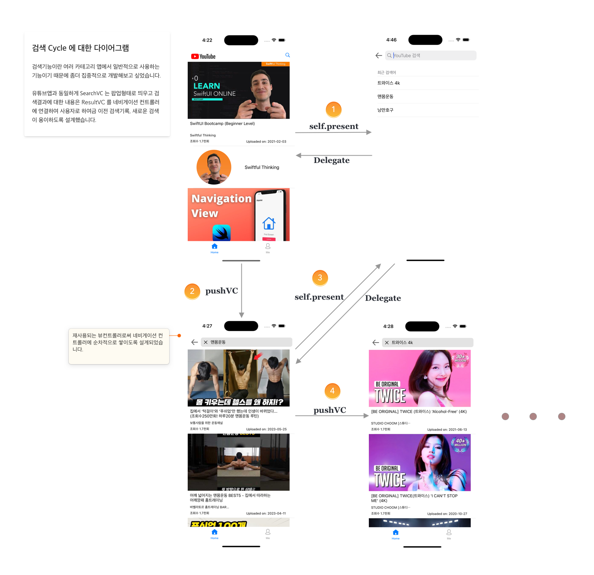

# youtube-filter-swift

## Features

- [x] Youtube API 연동
- [x] RealmSwift
- [x] Dark Mode 지원
- [x] Video Player
- [ ] 풀스크린, 세로모드 지원
- [ ] PIP
- [ ] Chromecast 연동

## Dependencies

- [Alamofire](https://github.com/Alamofire/Alamofire)
- [RealmSwift](https://github.com/realm/realm-swift)
- [SDWebImage](https://github.com/SDWebImage/SDWebImage)
- [SnapKit](https://github.com/SnapKit/SnapKit)
- Combine
- AVFoundation

## Demo

## Architecture

 